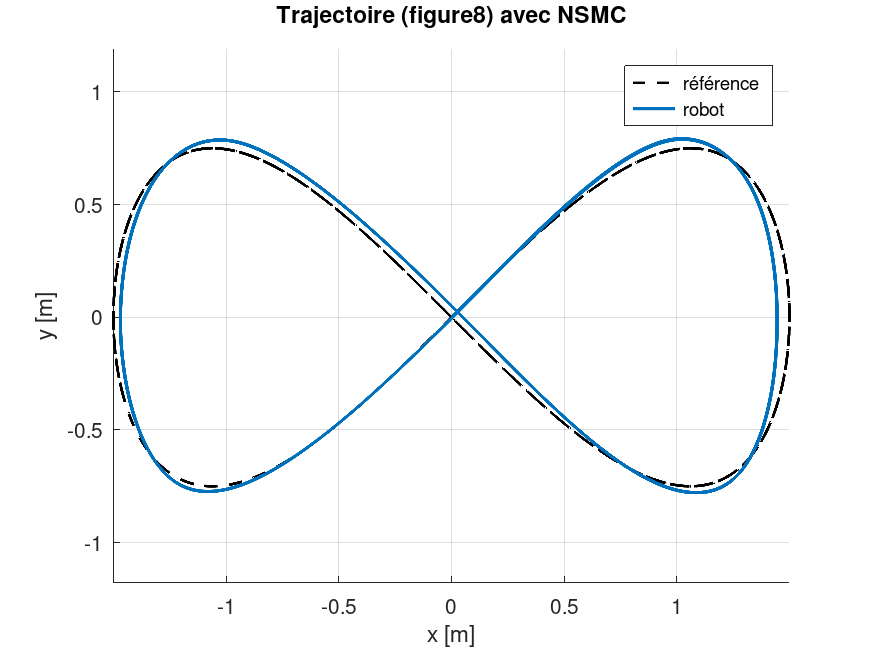
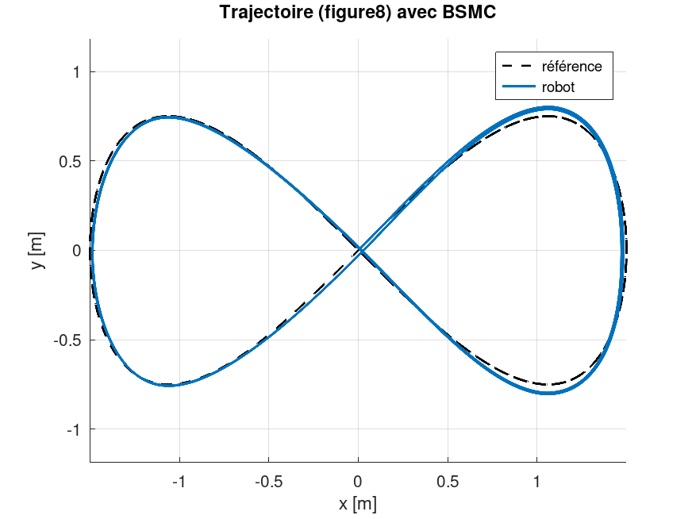
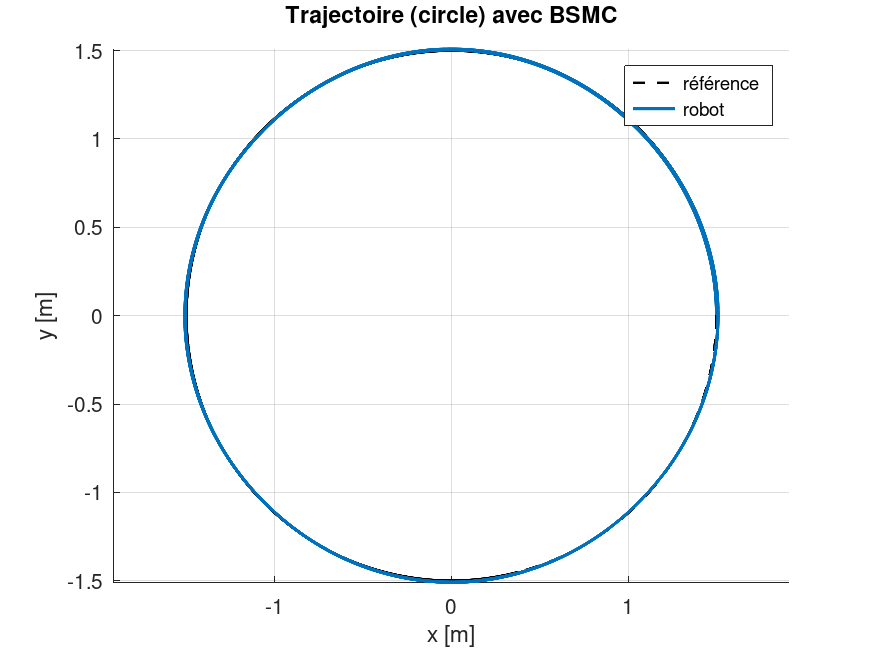
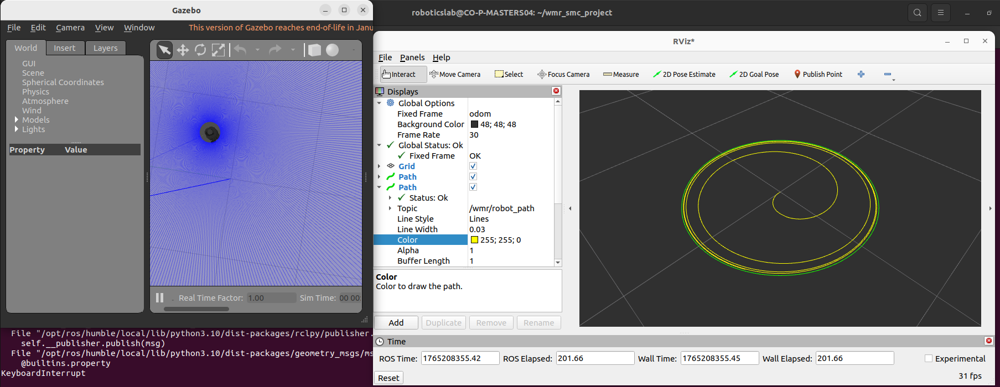
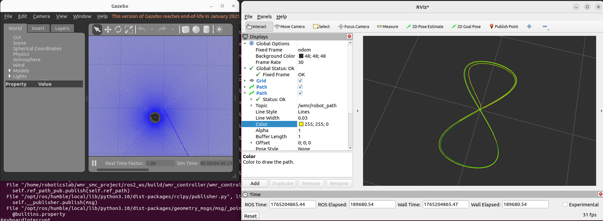
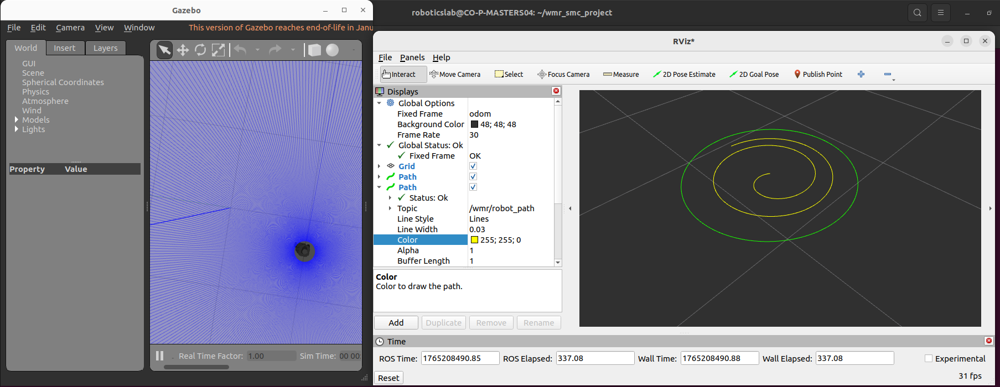
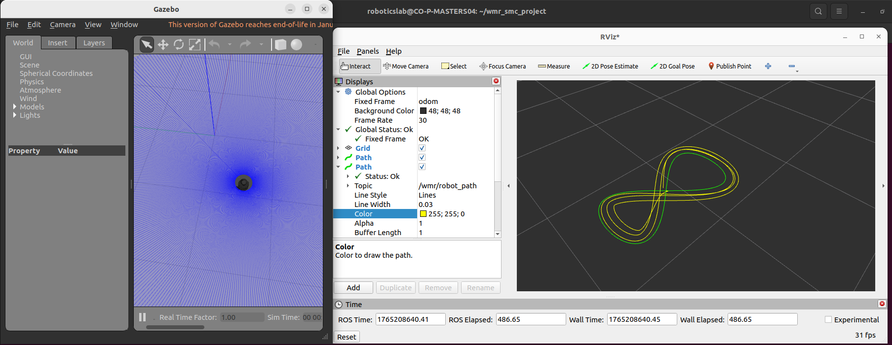

# WMR SMC Project – TurtleBot3 + ROS2 + NSMC / BSMC


This project implements and compares two control laws for a differential wheeled mobile robot (WMR – Wheeled Mobile Robot):

- **NSMC** – Novel Sliding Mode Controller  
- **BSMC** – Backstepping Sliding Mode Controller  

## Table of Contents

- [Introduction](#introduction)
- [Mathematical Problem Description](#mathematical-problem-description)
- [Project Structure](#project-structure)
- [Prerequisites](#prerequisites)
- [Installation](#installation)
- [How to Run](#how-to-run)
- [How to Run on a Real TurtleBot3 (Real-Time Experiments)](#how-to-run-on-a-real-turtlebot3-real-time-experiments)
- [Controller Parameters](#controller-parameters)
- [MATLAB Reference Implementation](#matlab-reference-implementation)
- [Documentation](#documentation)
- [Supported Trajectories](#supported-trajectories)
- [Differences Between NSMC and BSMC](#differences-between-nsmc-and-bsmc)
- [Results](#results)
- [Troubleshooting](#troubleshooting)
- [License](#license)
- [Contributing](#contributing)
- [Contact & Support](#contact--support)

## Introduction

This project introduces the implementation of a robust nonlinear control framework designed to ensure stable motion along circular and 8-shaped trajectories. The objective is to provide a practical solution that can be easily implemented with minimum configuration requirements.

## Mathematical Problem Description

We focus on the design and implementation of a robust nonlinear trajectory tracking controller for a mobile robot modeled using the unicycle kinematic model. The controller is validated both in MATLAB simulations and on a TurtleBot3 mobile robot running ROS 2.

### Robot Kinematic Model

The TurtleBot3 is represented by the standard unicycle model:

$$\begin{cases}
\dot{x} = v \cos \theta \\
\dot{y} = v \sin \theta \\
\dot{\theta} = \omega
\end{cases}$$

where:
- $x, y$ are the robot's global coordinates
- $\theta$ is the robot's orientation
- $v$ is the linear velocity input
- $\omega$ is the angular velocity input

This nonlinear model couples translation and orientation, making trajectory tracking a nonlinear control problem.

### Trajectory-Tracking Objective

The objective is to track a time-varying reference trajectory:

$$q_r(t) = \begin{bmatrix} x_r(t) \\ y_r(t) \\ \theta_r(t) \end{bmatrix}$$
by designing control inputs $v(t)$ and $\omega(t)$ such that the tracking error:

$$e(t) = q_r(t) - q(t)$$

satisfies $\lim_{t \to \infty} e(t) = 0$.

Two nonlinear trajectories are studied:
- Circular trajectory
- 8-shape trajectory

### Robustness Requirements

The controller must ensure tracking performance under:
- Model uncertainties (e.g., wheel slip, unmodeled dynamics)
- Sensor noise from odometry
- External disturbances
- Actuation limits (TurtleBot3 velocity bounds)

### Nonlinear Robust Control Formulation

The paper implements a nonlinear robust control law (backstepping, sliding mode, or error feedback linearization depending on the exact formulation), using:

**Error Transformation to Local Frame:**

$$\begin{bmatrix} e_x \\ e_y \end{bmatrix} = \begin{bmatrix} \cos\theta & \sin\theta \\ -\sin\theta & \cos\theta \end{bmatrix} \begin{bmatrix} x_r - x \\ y_r - y \end{bmatrix}$$


**Lyapunov Stability Condition:**

A Lyapunov function $V(e)$ is constructed such that:

$$\dot{V}(e) \leq -\alpha \|e\|^2 + \delta$$

where:
- $\alpha > 0$ determines the convergence rate
- $\delta$ bounds the effect of disturbances

This guarantees Input-to-State Stability (ISS) and robust performance under disturbances.

### Simulation and TurtleBot3 Implementation

The controller is first validated in MATLAB by simulating:

- the nonlinear robot dynamics
- circular and 8-shape trajectories
- external bounded disturbances

It is then deployed on a TurtleBot3 using ROS 2, receiving localization data from `/odom` and sending velocity commands to `/cmd_vel`.

---

## Project Structure

```text
wmr_smc_project/
├── ros2_ws/
│   ├── src/
│   │   ├── wmr_controller/          # ROS2 package – NSMC/BSMC controller
│   │   ├── tb3_explorer/            # (optional) TB3 teleoperation
│   │   └── turtlebot3_simulations/  # TurtleBot3 Gazebo (official clone)
│   ├── build/ install/ log/         # generated by colcon
│
├── matlab/
│   ├── wmr_smc.m                    # reference MATLAB code
│   ├── figures/                     # MATLAB trajectories and plots
│   ├── run_wmr_smc.sh               # script to run MATLAB simulation
│   └── notes/                       # theoretical notes SMC / BSMC
│
├── docs/
│   ├── architecture.md              # ROS2 architecture
│   ├── control_theory.md            # explanation NSMC / BSMC
│   ├── tuning_guide.md              # guide to tune the controller gains
│   └── images/
│
├── scripts/
│   ├── run_tb3_sim.sh               # launches TB3 + Gazebo (empty world)
│   ├── run_wmr_controller.sh        # launches the controller
│   ├── view_rviz.sh                 # launches RViz2 with the paths
│   └── wmr_tuning_helper.py         # helper for tuning gains
│
├── README.md
└── LICENSE
```

## Prerequisites

- Ubuntu 22.04 (Jammy)
- ROS2 Humble installed (`/opt/ros/humble`)
- TurtleBot3 packages for ROS2
- Octave or MATLAB (for running MATLAB simulations)

### Install ROS2 Dependencies

```bash
sudo apt install -y ros-humble-turtlebot3 ros-humble-turtlebot3-simulations \
ros-humble-gazebo-ros-pkgs python3-colcon-common-extensions
```

### Install Octave (for MATLAB simulations)

```bash
sudo apt install -y octave
```

## Installation

### 1. Clone the Repository

```bash
git clone https://github.com/thoukam/wmr_smc_project.git
cd wmr_smc_project
```

### 2. Get TurtleBot3 Packages

This project depends on two official TurtleBot3 packages for ROS 2 Humble:

- `turtlebot3`
- `turtlebot3_simulations`

**Option 1 — Install from system (recommended):**

The packages are automatically available after installing `ros-humble-turtlebot3` and `ros-humble-turtlebot3-simulations`.

**Option 2 — Clone the official repositories (alternative):**

```bash
cd ros2_ws/src
git clone -b humble-devel https://github.com/ROBOTIS-GIT/turtlebot3.git
git clone -b humble-devel https://github.com/ROBOTIS-GIT/turtlebot3_simulations.git
cd ..
```

### 3. Build the Workspace

```bash
cd ros2_ws
source /opt/ros/humble/setup.bash
colcon build --symlink-install
```

### 4. Setup Environment (Optional)

Add to your `~/.bashrc`:

```bash
source /opt/ros/humble/setup.bash
source ~/wmr_smc_project/ros2_ws/install/setup.bash
```

Then reload your shell:
```bash
source ~/.bashrc
```

---

## How to Run

### MATLAB Reference Model

Run the MATLAB simulation directly:

```bash
cd ~/wmr_smc_project/matlab
./run_wmr_smc.sh
```

Or manually:

```bash
QT_QPA_PLATFORM=offscreen octave wmr_smc.m
```

This generates plots and saves them to `matlab/figures/`.

### Full ROS2 Simulation

**Terminal 1 – Launch Gazebo with TurtleBot3:**

```bash
cd ~/wmr_smc_project
./scripts/run_tb3_sim.sh
```

This starts Gazebo with TurtleBot3 Burger in an empty world.

**Terminal 2 – Launch the NSMC/BSMC Controller:**

```bash
cd ~/wmr_smc_project
source ros2_ws/install/setup.bash
./scripts/run_wmr_controller.sh
```

Or with custom parameters:

```bash
./scripts/run_wmr_controller.sh NSMC circle
```

You should see real-time logs showing the controller behavior.

**Terminal 3 – Start RViz2 Visualization:**

```bash
cd ~/wmr_smc_project
source ros2_ws/install/setup.bash
./scripts/view_rviz.sh
```

**RViz displays:**
- Reference trajectory (`/wmr/ref_path`)
- Robot trajectory (`/wmr/robot_path`)

---

## Controller Parameters

The controller node exposes several ROS2 parameters:

| Parameter | Type | Default | Description |
|-----------|------|---------|-------------|
| `controller_type` | string | "NSMC" | "NSMC" or "BSMC" |
| `trajectory` | string | "circle" | "circle" or "figure8" |
| `R` | double | 1.5 | Trajectory radius (m) |
| `Omega` | double | 0.25 | Angular frequency (rad/s) |
| `Vmax` | double | 1.5 | Linear speed saturation (m/s) |
| `Wmax` | double | 1.5 | Angular speed saturation (rad/s) |
| `use_disturbance` | bool | true | Apply disturbance to test robustness |

**Example custom execution:**

```bash
ros2 run wmr_controller wmr_controller \
  --ros-args \
    -p controller_type:=NSMC \
    -p trajectory:=circle \
    -p R:=0.6 \
    -p Omega:=0.2 \
    -p Vmax:=0.22 \
    -p Wmax:=1.8 \
    -p use_disturbance:=true
```

---

## MATLAB Reference Implementation

`matlab/wmr_smc.m` contains:

- Full mathematical implementation of NSMC and BSMC
- Exact kinematic WMR model
- Circular and lemniscate reference trajectories
- Plots for:
  - Tracking errors
  - Control inputs
  - Robot vs reference trajectory

This serves as ground truth to validate the ROS2 controller.

---

## Documentation

The documentation in `/docs` explains the entire project:

**control_theory.md:**
- Sliding Mode Control basics
- NSMC surfaces and design
- BSMC derivation
- Stability considerations

**architecture.md:**
- ROS2 nodes and topics
- Data flow diagram

**tuning_guide.md:**
- How to tune controller gains for different scenarios
- Recommended gain values

---

## Supported Trajectories

### ✔ Circle
Perfect for stable trajectory tracking tests.

### ✔ Figure-8 (Lemniscate of Gerono)
More challenging, validates nonlinear behavior and robustness.

---

## Differences Between NSMC and BSMC

| Aspect | NSMC | BSMC |
|--------|------|------|
| **Convergence Speed** | Fast, aggressive | Slower, gradual |
| **Control Smoothness** | Potentially oscillatory | Very smooth |
| **Tracking Accuracy** | Higher on curves | Good, slightly lower |
| **Noise Sensitivity** | More sensitive | Robust to noise |
| **Disturbance Handling** | Excellent for strong | Good for moderate |
| **Real Robot Suitability** | Requires careful tuning | Better for real systems |

**Summary:**
- **NSMC** is more reactive and precise, but requires careful gain tuning
- **BSMC** is smoother and more robust, better for real robots

---

## Results

### MATLAB Simulations

#### NSMC
- Figure-8: 
- Circle: 

#### BSMC
- Figure-8: 
- Circle: 

### ROS2 Gazebo Simulation

#### NSMC
- Circle: 
- Lemniscate: 

#### BSMC
- Circle: 
- Lemniscate: 

### Real TurtleBot3 Results

Experimental validation on a real TurtleBot3 Burger robot demonstrates the effectiveness of both NSMC and BSMC controllers in real-world conditions.

#### Video Demonstrations

- **Full experiment playlist:** [Watch on Google Drive](https://drive.google.com/drive/folders/1AqdatpttKd4xT3uOgKL4xw1w8i_5uC5-?usp=sharing)
  - NSMC circular trajectory tracking
  - BSMC circular trajectory tracking
  - Disturbance rejection tests
  - Trajectory switching and robustness

#### Quick Demo GIF


*Real robot executing circular trajectory with NSMC controller.*

#### Key Observations
- **NSMC:** Faster convergence, tighter tracking, but more motor activity
- **BSMC:** Smoother motion, less aggressive control, better energy efficiency
- Both controllers handle real-world odometry noise effectively
- Disturbance rejection validated with manual perturbations
---

## How to Run on a Real TurtleBot3 (Real-Time Experiments)

This project can run in Gazebo (simulation only on your PC) and on a real TurtleBot3 (Burger/Waffle). Below is a concise checklist to run the NSMC/BSMC controller on the physical robot.

### 0. Assumptions & Prerequisites
- TurtleBot3 (Burger recommended) with ROS 2 Humble installed on the SBC (Raspberry Pi or similar)
- Existing TurtleBot3 workspace (`turtlebot3_ws`) already set up on the robot with `turtlebot3_bringup` and `turtlebot3_simulations`
- Your laptop/PC and the robot are on the same network
- ROS 2 Humble is installed on your laptop

### 1. Important Notes

#### Simulation vs Real Robot
- **Simulation (Gazebo/RViz):** Always runs on your PC, never on the robot (too resource-intensive)
- **You do NOT need to be connected to a real robot to test simulations:** You can test locally on your PC
- **Controller node:** Runs on either the robot (real-time control) or your PC (simulation)
- **Visualization (RViz):** Always on your PC, even when running on real robot

#### Two Deployment Options

**Option A — Clone full project on robot (then simulate + real testing):**
- Clone this entire repository on the robot
- Clone `turtlebot3` and `turtlebot3_simulations` in the same workspace
- More complete, but takes more space on SBC

**Option B — Copy only wmr_controller to robot (RECOMMENDED for real robot):**
- The robot already has `turtlebot3_ws` with TurtleBot3 packages
- Copy only the `wmr_controller` package into the robot's existing workspace
- More efficient for real-time operation
- Recommended approach for production use

### 2. Deploy wmr_controller to Robot (Option B – Recommended)

#### Step A: Copy wmr_controller package via SSH
From your laptop, copy the controller to the robot's workspace:
```bash
# Copy wmr_controller folder to robot's turtlebot3_ws
scp -r ~/wmr_smc_project/ros2_ws/src/wmr_controller ubuntu@<turtlebot-ip>:~/turtlebot3_ws/src/
```

#### Step B: Build on the robot
SSH into the turtlebot and build:
```bash
ssh ubuntu@<turtlebot-ip>
cd ~/turtlebot3_ws
colcon build --symlink-install
source install/setup.bash
```

### 3. Network & Environment Setup (Robot + Laptop)

On **both machines** set the same ROS_DOMAIN_ID (example: `30`) and allow network:
```bash
export ROS_DOMAIN_ID=30
export ROS_LOCALHOST_ONLY=0
source /opt/ros/humble/setup.bash
```

On your **laptop** also source the workspace:
```bash
cd ~/wmr_smc_project/ros2_ws
source install/setup.bash
```

On the **turtlebot** source its workspace:
```bash
cd ~/turtlebot3_ws
source install/setup.bash
```

### 4. Start TurtleBot3 Bringup (on the Robot)
SSH into the turtlebot and start the hardware layer:
```bash
ssh ubuntu@<robot-ip>
export ROS_DOMAIN_ID=30
export ROS_LOCALHOST_ONLY=0
export TURTLEBOT3_MODEL=burger
source /opt/ros/humble/setup.bash
source ~/turtlebot3_ws/install/setup.bash
ros2 launch turtlebot3_bringup robot.launch.py
```

This starts:
- Motor driver (subscribes to `/cmd_vel`)
- Odometry sensor (`/odom` publisher)
- TF transforms

From your laptop, verify connectivity:
```bash
ros2 topic list | grep -E "(cmd_vel|odom)"
```

### 5. Run the WMR Controller (on the Robot)
In a new SSH terminal to the robot, launch the controller with conservative parameters:
```bash
ssh ubuntu@<robot-ip>
export ROS_DOMAIN_ID=30
export ROS_LOCALHOST_ONLY=0
source /opt/ros/humble/setup.bash
source ~/turtlebot3_ws/install/setup.bash

ros2 run wmr_controller wmr_controller \
  --ros-args \
    -p controller_type:=NSMC \
    -p trajectory:=circle \
    -p R:=0.4 \
    -p Omega:=0.15 \
    -p Vmax:=0.15 \
    -p Wmax:=1.0 \
    -p use_disturbance:=false
```

The controller node will:
- Subscribe to `/odom` (robot odometry from Raspberry Pi)
- Compute reference trajectory in the `odom` frame
- Publish control commands to `/cmd_vel` (motors)
- Publish `/wmr/ref_path` and `/wmr/robot_path` for visualization

### 6. Visualize on Your Laptop (Optional)
On your laptop only (NOT on the robot):
```bash
cd ~/wmr_smc_project/ros2_ws
source install/setup.bash
rviz2
```

You will see:
- Reference path (`/wmr/ref_path`)
- Actual robot path (`/wmr/robot_path`)
- TF frames
- Real-time robot position from `/odom`

### 7. Safety Tips
- Start with small radius and low speeds: `R ∈ [0.3, 0.5]` m, `Vmax ∈ [0.10, 0.18]` m/s, `Wmax ∈ [0.8, 1.2]` rad/s
- Ensure a clear, open area (at least 2m × 2m) and have an emergency stop ready
- Test in simulation first (Gazebo on your PC) before running on the real robot
- Monitor logs in real-time for any errors or warnings
- If the robot deviates significantly, press **Ctrl+C** immediately on the robot terminal
- If motion is unstable: stop (`Ctrl+C`), reduce gains (`a11,a12,a21,a22,k1,k2`) and lower `Vmax`/`Wmax`.

### 7. Test with disturbances (optional)
To enable simulated disturbances on the real robot (for robustness tests):
```bash
ros2 run wmr_controller wmr_controller \
  --ros-args \
    -p controller_type:=NSMC \
    -p trajectory:=circle \
    -p R:=0.4 \
    -p Omega:=0.15 \
    -p Vmax:=0.15 \
    -p Wmax:=1.0 \
    -p use_disturbance:=true
```
---

## Troubleshooting

### Octave not found
```bash
sudo apt install -y octave
```

### Octave crashes with graphics error
Use the offscreen backend:
```bash
QT_QPA_PLATFORM=offscreen octave wmr_smc.m
```

### ROS2 workspace not sourced
```bash
source /opt/ros/humble/setup.bash
source ~/wmr_smc_project/ros2_ws/install/setup.bash
```

### TurtleBot3 packages not found
```bash
sudo apt install -y ros-humble-turtlebot3 ros-humble-turtlebot3-simulations
```

Or manually clone:
```bash
cd ros2_ws/src
git clone -b humble-devel https://github.com/ROBOTIS-GIT/turtlebot3.git
git clone -b humble-devel https://github.com/ROBOTIS-GIT/turtlebot3_simulations.git
cd .. && colcon build
```

### Gazebo/RViz doesn't start
1. Install missing packages:
   ```bash
   sudo apt install -y ros-humble-gazebo-ros-pkgs ros-humble-rviz2
   ```

2. Source environment:
   ```bash
   source /opt/ros/humble/setup.bash
   ```

---

## License

This project is licensed under the MIT License – see the [LICENSE](LICENSE) file for details.

---

## Contributing

Contributions are welcome! Please:

1. Fork the repository
2. Create a feature branch (`git checkout -b feature/amazing-feature`)
3. Commit your changes (`git commit -m 'Add amazing feature'`)
4. Push to the branch (`git push origin feature/amazing-feature`)
5. Open a Pull Request

---

## Contact & Support

For questions or issues, please open a GitHub Issue.

**Author:** Yves Thoukam && Jeol Therence 
**Repository:** [wmr_smc_project](https://github.com/thoukam/wmr_smc_project)
